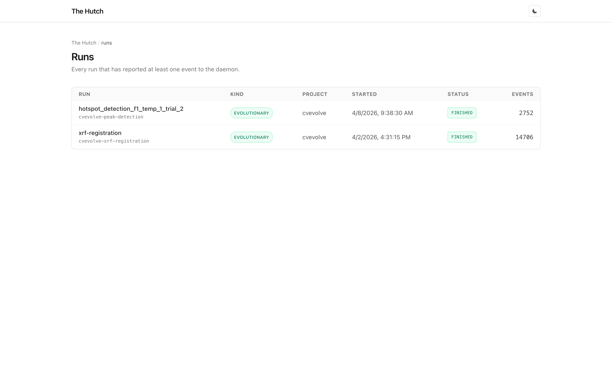
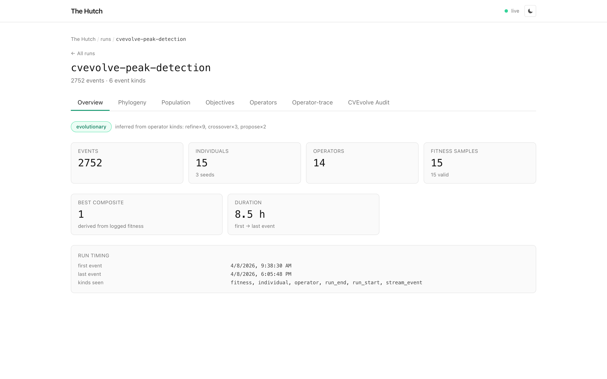
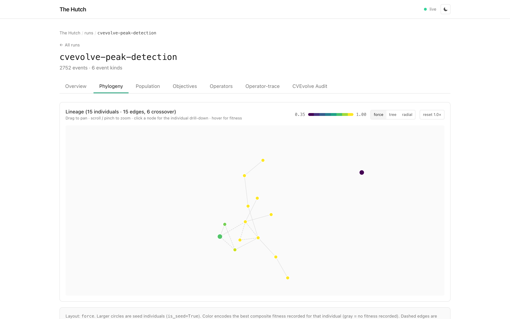
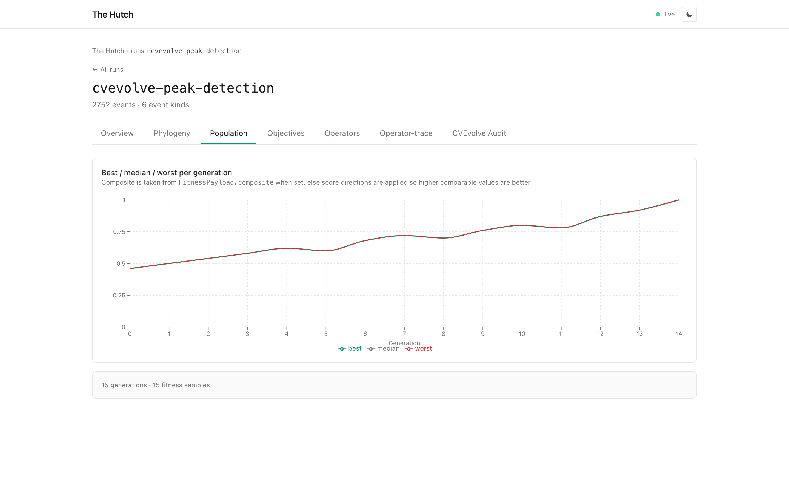
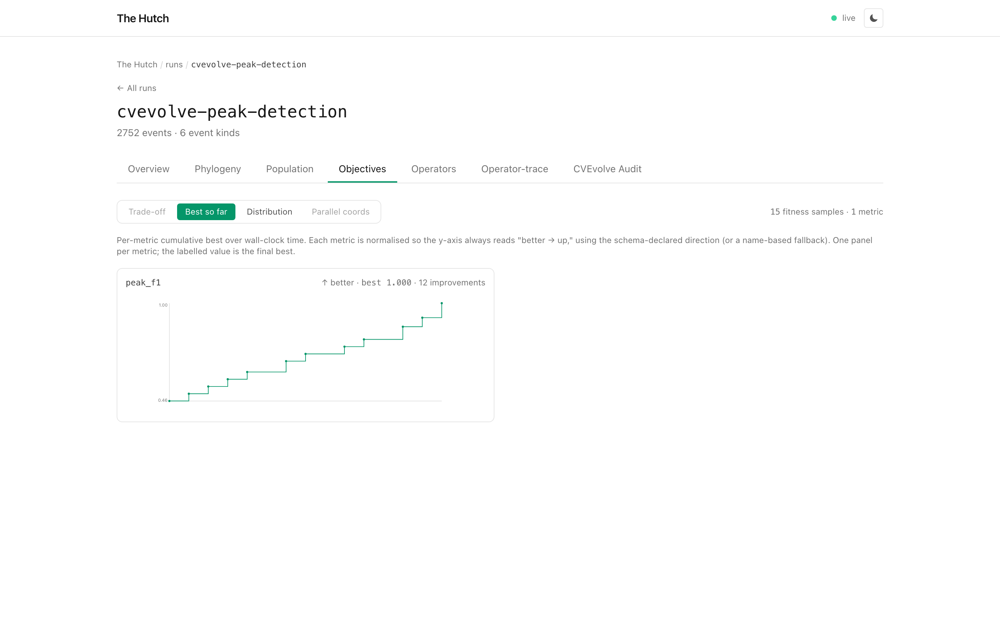
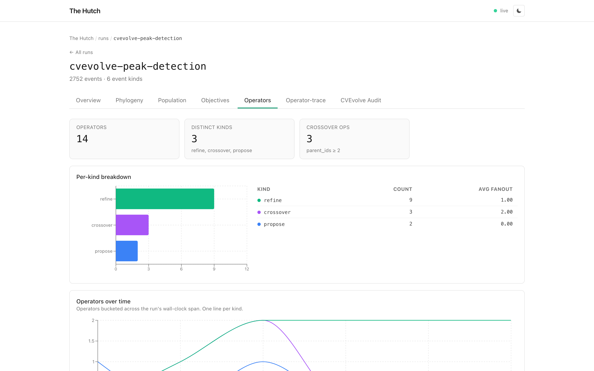
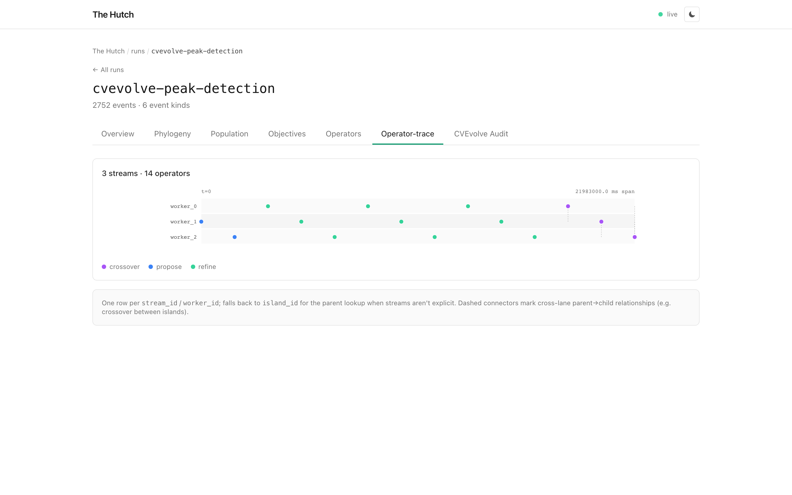
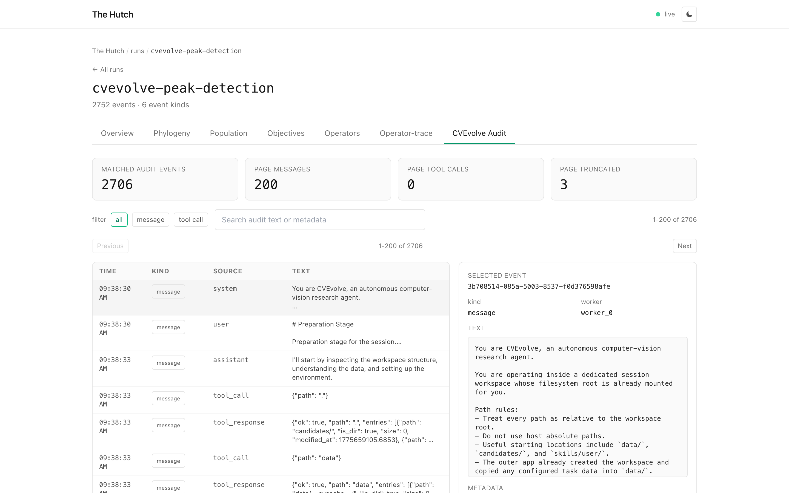
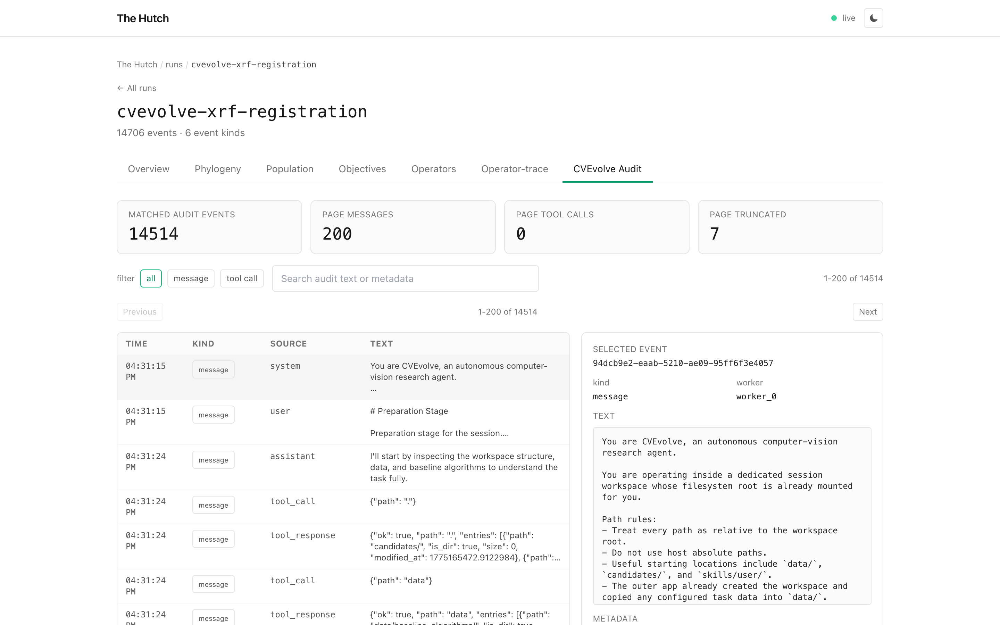

# CVEvolve in Hutch: live runs, lineage, and audit logs

*v0.1.1, May 11, 2026*

Today we're adding first-class CVEvolve support to Hutch. Point Hutch at
a CVEvolve session root, or directly at `history/search_history.sqlite`,
and the dashboard turns the run into the same canonical event stream as
the rest of Hutch: Individuals, Operators, Fitness, lineage, and
optional audit logs.

That means CVEvolve runs no longer have to be inspected through terminal
scrollback or raw SQLite queries. You can watch the search while it is
active, see what kind of operator produced each candidate, follow the
parent graph, and open the prompt/tool-call audit trail only when you
need it.

## Watch or import

For a running session, use `hutch watch`:

```bash
hutch serve
hutch watch /path/to/cvevolve/session --format cvevolve
```

Hutch polls CVEvolve's history database and writes only new events. The
run appears as `running` until `session_state.phase` becomes
`completed`; then Hutch emits the terminal `run_end`.

For a finished session, use the regular importer:

```bash
hutch import /path/to/cvevolve/session --format cvevolve
```

Audit logs are opt-in because they can be large. Add `--include-audit`
when you want CVEvolve's message and tool-call records in the dashboard:

```bash
hutch import /path/to/cvevolve/session --format cvevolve --include-audit
```

## A real run in the dashboard

The screenshots below use a CVEvolve peak-detection session. The run has
15 candidates, 14 operators, 15 fitness samples, and 2,706 imported
audit messages. CVEvolve explored a baseline, generated proposals,
tuning steps, and crossover rounds.


*CVEvolve imports show up in the normal run list with project, status,
event count, and inferred system kind. The peak-detection and XRF runs
are both classified as evolutionary.*

The Overview tab is meant to answer the first questions a researcher
asks when opening a run: how many candidates were explored, which search
operators were used, how much fitness evidence exists, and how the run
evolved over time.


*The overview is intentionally focused: counts, fitness, lineage
evidence, and timing are visible before you move into the detailed
tabs.*

The tab bar follows the evidence Hutch imported from this run: lineage,
population progress, objective history, operator summaries, operator
timelines, and the optional CVEvolve audit log.

## What gets mapped

The adapter reads CVEvolve's SQLite history directly:

| CVEvolve source | Hutch event |
|---|---|
| `candidates` | `individual` |
| `parent_ids_json` | lineage edges |
| candidate `action` | `operator` (`propose`, `refine`, `mutate`, `crossover`) |
| `metrics` | primary/secondary `fitness` |
| `holdout_test_metrics` | holdout `fitness` |
| `candidate_failures` | `stream_event` with label `candidate_failure` |
| `messages.sqlite` / `tool_calls.sqlite` | opt-in audit `stream_event`s |

CVEvolve metric directions are preserved. A `maximize` metric becomes
Hutch `higher`; a `minimize` metric becomes `lower`, with composite
scores normalized so the dashboard still has one higher-is-better
aggregate for comparison.

The Phylogeny tab is built from CVEvolve's parent IDs. It is not guessing
lineage from log order.


*The graph follows CVEvolve candidate IDs and parent IDs, including tune
and crossover edges.*

The Population tab turns fitness events into a generation-by-generation
trajectory. For this run, the search logs one scored candidate per
generation, so the best, median, and worst lines move together while the
primary score improves.


*The population view shows the peak-detection score rising across 15
generations and 15 fitness samples.*

The Objectives tab keeps the metric name and direction visible. In the
peak-detection run, `peak_f1` is the primary objective, so the best-so-far
view is the clearest way to read progress.


*The objective history shows the cumulative best `peak_f1` value and the
number of improvements made during the search.*

The Operators tab shows how the search moved. In this peak-detection
run, Hutch can distinguish generated proposals, refinements, and
crossover-produced candidates rather than flattening everything into a
single candidate list.


*CVEvolve actions become canonical Hutch operators, so the search policy
is visible at a glance.*

The Operator-trace tab adds timing and worker lanes. That makes it easier
to see when proposals, refinements, and crossovers happened, and which
worker produced each candidate.


*The operator trace lays out 14 operators across three worker streams,
with crossover events shown as their own operator type.*

## Audit logs without loading the whole trace

CVEvolve audit logs are useful when you need to understand what the
agent saw or which tool call produced a result. They can also be much
larger than the candidate history, so Hutch leaves them out by default.

When you import with `--include-audit`, the dashboard reads audit rows
through a paged endpoint:

```text
GET /runs/{run_id}/stream_events?label=&query=&offset=&limit=
```

The CVEvolve Audit tab asks the daemon for one bounded page at a time.
Filtering by message/tool-call label and searching audit text also
happen server-side.


*The peak-detection run has 2,706 audit events; the UI is showing the
first 200.*

The same path scales to larger traces. The XRF registration run below
has 14,514 matched audit messages, but the browser still requests one
page, not the whole audit table.


*The XRF run is a larger audit-trace check: 14,514 matched events, paged
server-side.*

## Two ways to integrate

There are two useful paths:

1. **Hutch-side polling.** Use `hutch watch` on an existing CVEvolve
   session. No CVEvolve code changes are required.
2. **Native CVEvolve tracking.** Enable CVEvolve's Hutch integration
   when you want lower-latency SDK events from inside the run.

Both paths use deterministic event IDs, so restarting a watcher does not
duplicate the event log. For long-running sessions, you can also pin the
watch checkpoint explicitly:

```bash
hutch watch /path/to/session \
  --format cvevolve \
  --watch-state ~/.hutch/watch-state/my-cvevolve-run.json
```

## Try it

```bash
pip install thehutch
hutch serve &
hutch watch /path/to/cvevolve/session --format cvevolve
```

Add audit only when you need it:

```bash
hutch import /path/to/cvevolve/session \
  --format cvevolve \
  --include-audit
```

The goal is simple: CVEvolve should be legible while it is running and
auditable after it finishes. Hutch keeps the dashboard focused on the
evidence available for each run, so a small run stays readable and a
large audit trace stays navigable.
