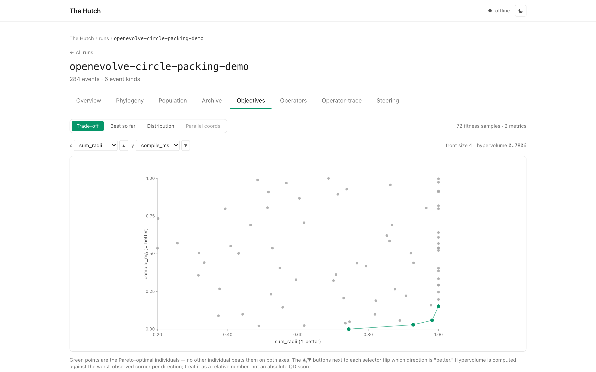
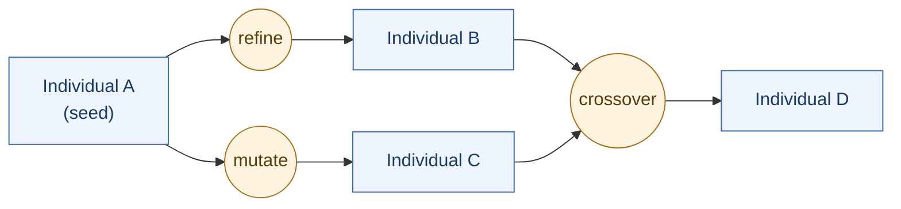
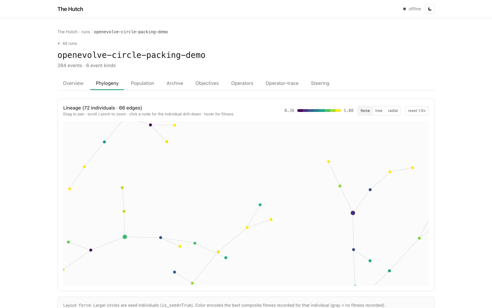
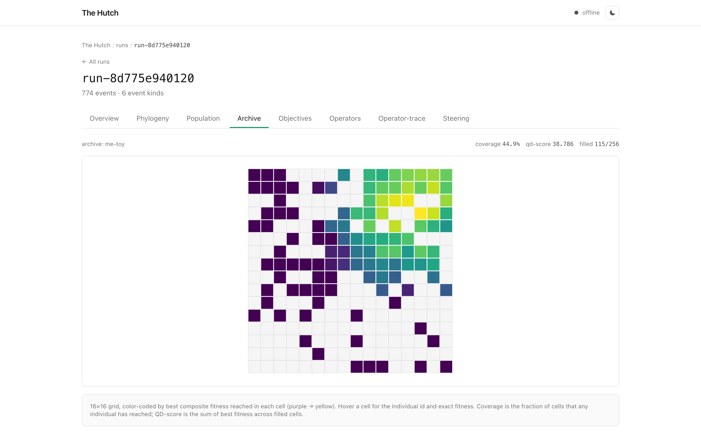
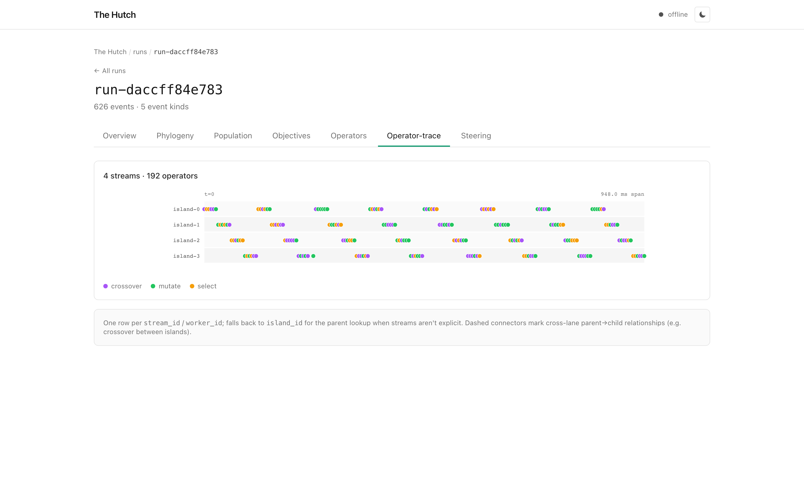

# Concepts

This page introduces the five concepts that every Hutch view is built on,
and three structural pieces that hold them together. Read it before the
schema reference: the field names there will mean more once you know which
concept each one belongs to.

Hutch's bet is that a small, fixed vocabulary can describe every
autoresearch loop in the literature, from a five-line hypothesis chain to
a thousand-experiment ASI-ARCH run. So far that has held up.

## The five concepts

### Individual

A single candidate object. Whatever your loop is searching over, that
unit is an Individual.

| System family | What an Individual usually is |
|---|---|
| Linear research | The current hypothesis, claim, or experiment plan |
| Evolutionary coding (OpenEvolve, ShinkaEvolve, FunSearch) | A program in the population |
| Self-improvement (DGM, SICA) | A snapshot of the agent's own codebase |
| Tree search (AIDE) | A node in the search tree |
| Quality-diversity (MAP-Elites, POET, QDax) | A solution placed in an archive cell |
| Theorem proving | A proof state or theorem statement |
| Architecture search (ASI-ARCH) | A neural architecture spec |

The schema labels what kind of object it is (`program`, `prompt`,
`theorem`, `architecture`, etc.) with the `IndividualKind` enum, so the
data model stays useful across system families.

### Operator

The event that produces an Individual from zero or more parents.

| System family | Common operators |
|---|---|
| Linear | `propose`, `refine` |
| Evolutionary | `mutate`, `crossover`, `select`, `migrate` |
| Self-improvement | `self_modify` |
| Tree search | `tree_expand` |
| LLM-driven generic | `propose`, `refine`, `distill`, `meta_mutate` |

`parent_ids` is just a list, with no fixed length. Zero parents is a
seed, one is a refine or a mutation, two is a crossover, more is an
ensemble or a distillation. Crossover is not special; it is an operator
with two parents.

### Fitness

A multi-metric scalar evaluation of an Individual.

- **Multi-metric** because real autoresearch systems track several scores
  at once (accuracy and cost, `sum_radii` and `compile_ms`, novelty and
  reproducibility).
- **Cascaded** because cheap evaluators run first and expensive ones run
  on survivors. The schema records which stage produced the score.
- **Pluralistic on source.** The `evaluator_kind` field distinguishes
  deterministic metrics, unit tests, benchmarks, LLM judges, humans, wet
  labs, simulators, and proof checkers. The dashboard treats them
  differently.
- **Failures are first-class.** A timeout, syntax error, or sandbox
  crash gets logged with `invalid_reason` set rather than dropped.

*The Objectives view: a trade-off plot between two metrics
(`sum_radii` and `compile_ms`). Green points are the Pareto front;
the hypervolume number summarizes the front's quality.*

### Lineage

The DAG formed by the `parent_ids` pointers between Individuals.

- Linear runs collapse to a chain (fanout 1).
- Evolutionary runs are a DAG once you allow crossover.
- Self-improvement is a tree of agent versions.
- Tree search is a tree by definition.

Boxes are Individuals; circles are Operators. Each Operator has
`parent_ids` (its inputs) and a `child_id` (its output), which is how
the DAG forms.

The Phylogeny view in the dashboard renders this as a force-directed
graph, and it falls back to a vertical chain on linear runs.

*The Phylogeny view for a 72-individual evolutionary run. Larger
circles are seed Individuals; color encodes the best composite fitness
recorded for that Individual (purple → yellow). The same view also
supports tree and radial layouts.*

### Archive (optional)

A structured collection of Individuals indexed by *behavior descriptor*
rather than fitness. Three flavors are supported today:

- **Grid** for rectangular MAP-Elites grids.
- **CVT** (Centroidal Voronoi Tessellation) for descriptors with too
  many dimensions to grid.
- **AURORA** for learned latent-space descriptors.

If your run logs no `descriptor` events, the dashboard hides the Archive
view rather than showing an empty grid. Quality-diversity is opt-in.

*The Archive view for a 16×16 MAP-Elites grid. Each cell is one
behavior bucket; color encodes the best composite fitness reached
there. The header reports coverage (fraction of cells filled) and
QD-score (sum of best fitness across filled cells).*

## Three structural pieces

These hold the concepts above together. They are less central than the
five, but you will see their names in the schema and the docs.

### Run

The top-level container. Every event belongs to exactly one run. A run
can have multiple populations (parallel islands, for example), multiple
archives (a MAP-Elites grid plus a Pareto front), and multiple streams.

### Stream (or worker)

A swimlane: one process, one agent role, or one parallel evaluator.
ASI-ARCH has Researcher, Engineer, and Analyst streams. OpenEvolve has
sampler and evaluator workers. The Operator-Trace view renders one lane
per stream.

If a run does not declare streams, every event lives on a single default
lane and the swimlane view is just a single timeline.

*The Operator-trace view for a 4-island evolutionary run, with
operators colored by kind (`crossover`, `mutate`, `select`). Each row
is one stream.*

### Steering Command

A write-back event from the dashboard to the running agent. The
vocabulary is `cancel_individual`, `freeze_island`, `fork_from`,
`override_param`, `pause_run`, `resume_run`, `cancel_self_mod`,
`approve_hitl`, and `inject_hint`.

The agent polls a queue between iterations and executes the commands it
receives. This is the mechanism that turns the dashboard from a viewer
into a control surface; details are in [Steering](steering.md).

## Design notes

A few constraints are deliberate, and worth knowing if you are extending
Hutch:

- The model does not assume evolutionary structure. Linear runs render
  with the same views as evolutionary ones: a population of one, a
  fanout of one.
- The model does not assume LLM-only evaluation. Wet-lab fitness and
  human review are both valid `evaluator_kind` values.
- Lineage is a DAG, not a tree, so arbitrary fanout is fine.
- Multi-objective is native. `is_pareto_front` and `dominates` ride on
  the FitnessPayload.
- Multiple archives per run is fine; they get different `archive_id`s.

If a future system genuinely needs a sixth concept, we will add it. For
now, the five hold up.
