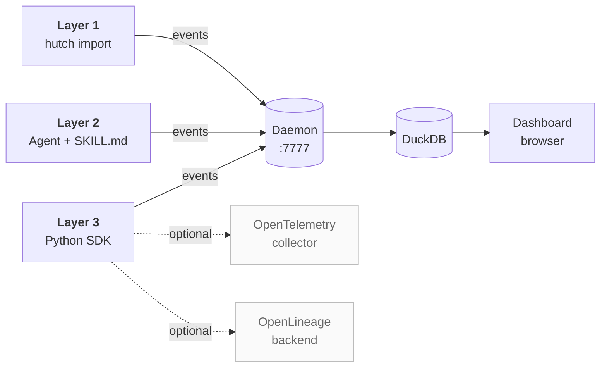
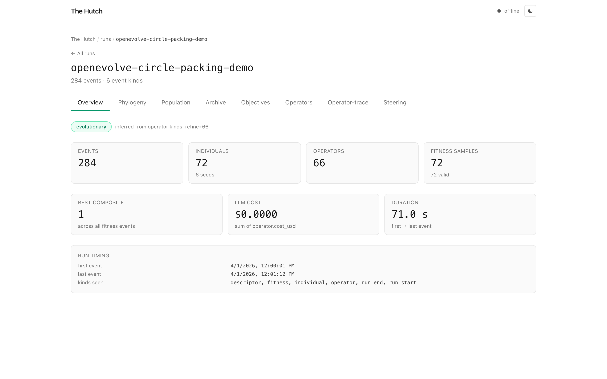

# Distribution

Hutch ships in three layers. Pick the one that matches your effort budget;
they all write to the same canonical event store, and the dashboard treats
events from any layer identically.

| Layer | Surface | Coverage | Time to first dashboard |
|---|---|---|---|
| **1. Importer** | `hutch import <path>` (ten built-in adapters plus an LLM fallback) | Every system | Seconds |
| **2. Skill** | Drop `SKILL.md` into your agent's instructions | Any LLM-driven loop | One agent restart |
| **3. SDK** | `import hutch as h; h.log_*(...)` | Any Python loop you control | Hours |



Whichever layer you use, the dashboard you get looks the same:


*The Overview tab for an OpenEvolve circle-packing run: 284 events
across 6 event kinds, broken down into top-line counters (individuals,
operators, fitness samples) plus run timing.*

Most users start at Layer 1 and move down only when they need the
extra resolution. A user who never goes past `hutch import` already gets
the full dashboard.

## Layer 1: importer

```bash
pip install thehutch
hutch serve &                   # localhost:7777
hutch import ./checkpoint       # auto-detects from the registry
```

Ten systems have built-in adapters in v0.1.0: OpenEvolve, AIDE, DGM,
QDax, ASI-ARCH, FunSearch, CORAL, POET, ptychi-evolve, and ShinkaEvolve.
See [Adapters](adapters.md) for the format each one expects.

For anything else, the LLM-assisted importer reads a file or directory
of unknown records, asks an LLM to write a `to_canonical(record)`
adapter, validates the output in a constrained subprocess on a held-out
sample, and reports coverage:

```bash
hutch import ./novel-format --llm
# loads .env if present (OPENAI_API_KEY or ANTHROPIC_API_KEY)
# detects → generates → validates → caches → emits
# coverage: 96 events written; sample 12/12 (100%) full 96/96 (100%)
```

Generated adapters are cached at
`~/.hutch/adapters/<prompt-fingerprint>.json`, so importing the same
format a second time hits the cache instead of calling the LLM. The
validation subprocess is defense in depth, not a kernel sandbox; the
trust boundary is documented in [security.md](security.md#llm-importer).

## Layer 2: skill

`hutch-skill/SKILL.md` is the deliverable that makes Hutch's write side
work for an LLM-driven agent. Drop it into your agent's instruction
surface (a `.claude/skills/hutch/SKILL.md` file, the system prompt of a
custom GPT, your Cursor rules, and so on). The agent then learns the
canonical event vocabulary plus the steering-poll protocol.

The skill instructs the agent to either:

- import `hutch` and call `h.log_individual`, `h.log_fitness`,
  `h.log_operator`, etc., or
- POST canonical JSON to `http://localhost:7777/events` if it has no
  Python dependency.

Five worked examples in `hutch-skill/examples/` cover the full event
vocabulary across linear, evolutionary, self-improving, tree-search, and
quality-diversity loops. The most important behavior the skill teaches
is to poll the steering channel between iterations; see
[Steering](steering.md) for what that buys you.

## Layer 3: SDK

```python
import hutch as h

h.start_run(name="circle-packing", project="research")
seed = h.log_individual(kind="program")
h.log_fitness(individual=seed, scores={"sum_radii": 2.63})
h.end_run()
```

The SDK has two transports:

- **Daemon mode** (default). The SDK posts events to
  `http://localhost:7777/events`. Configure with `HUTCH_DAEMON_URL` or
  `hutch.configure(SDKConfig(mode="daemon", daemon_url=...))`.
- **Embedded mode.** The SDK writes directly to a local DuckDB file.
  Useful in CI, notebooks, and single-script runs. Activate with
  `HUTCH_DB_PATH=/tmp/hutch.duckdb` or
  `SDKConfig(mode="embedded", db_path=...)`.

The default is non-strict: transient transport failures get queued to a
fallback JSONL on disk and replayed when the daemon comes back. SDK
calls do not raise on capture failures, because a research loop should
not crash because telemetry is down. Set `HUTCH_STRICT=1` to opt into
raising.

### Optional OpenTelemetry emitter

The SDK can additionally emit OpenTelemetry spans on the `research.*`
namespace, alongside the regular daemon or embedded transport. Set
`HUTCH_OTEL_ENDPOINT` to enable it, and install the `[otel]` extra
(`pip install thehutch[otel]`). See [otel.md](otel.md).

### Optional OpenLineage emitter

The SDK can also POST OpenLineage `RunEvent`s to a Marquez,
OpenMetadata, or DataHub backend. Set `HUTCH_OPENLINEAGE_ENDPOINT` to
enable it. No extra install is needed: the emitter speaks OL 2.0 JSON
over HTTP directly. It composes with the OTel emitter; you can enable
both. See [openlineage.md](openlineage.md).

### Publication exports

Three offline serializers for finished runs: `hutch export ara` for a
self-contained tarball that round-trips, `hutch export prov` for W3C
PROV-O, and `hutch export ro-crate` for a Workflow Run RO-Crate. All
three read from the same canonical event log. Only the alternate PROV-O
serializations (JSON-LD, N-Triples, RDF-XML) need an extra
(`pip install thehutch[publish]`); Turtle works without one. See
[publication.md](publication.md).

## Choosing a layer

| Situation | Use |
|---|---|
| You inherited a checkpoint dir from someone else | Layer 1 |
| You're building a new agent that runs through Claude or GPT | Layer 2 |
| You're writing a Python loop you control | Layer 3 |
| You want long-term observability for a production system | Layer 3 plus OTel |

You can mix freely. The daemon ingests events from any layer and the
dashboard treats them uniformly.
