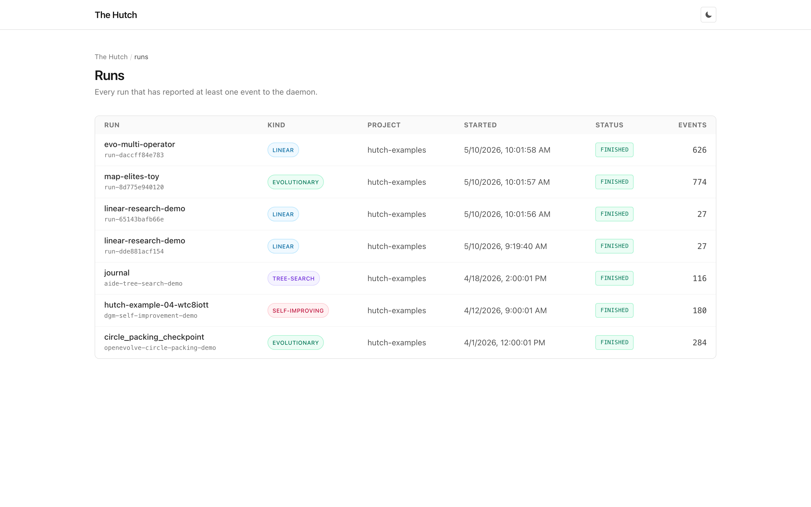

---
hide:
  - navigation
---

# The Hutch

> Observability, steering, and provenance for autonomous-research agents.

The Hutch is a dashboard for autonomous-research agents. It works for a small
linear "hypothesis → experiment → claim" loop and scales up to large
evolutionary or self-improving systems like OpenEvolve, ShinkaEvolve, DGM,
CVEvolve, SICA, AIDE, ASI-ARCH, FunSearch, POET, and MAP-Elites.

Whatever your loop looks like, Hutch normalizes it into the same five
concepts: **Individual, Operator, Fitness, Lineage, Archive**. One dashboard
then works for all of them.

```bash
pip install thehutch       # PyPI distribution name; imports as `hutch`
hutch serve                # → http://localhost:7777
```


*The dashboard's entry point: every run that has reported at least one
event to the daemon, with kind, project, status, and event count.*

## Where to start

<div class="grid cards" markdown>

-   :material-lightbulb-on:{ .lg .middle } **Concepts**

    ---

    The five concepts every Hutch view is built on. Read this first; the
    rest of the docs assume it.

    [:octicons-arrow-right-24: Concepts](concepts.md)

-   :material-rocket-launch:{ .lg .middle } **Distribution**

    ---

    Three ways to feed data into Hutch: import or watch an existing
    checkpoint, drop the LLM skill into your agent, or call the Python SDK.

    [:octicons-arrow-right-24: Distribution](distribution.md)

-   :material-database-outline:{ .lg .middle } **Event schema**

    ---

    The data model every layer normalizes into. Required reading before
    you write an adapter.

    [:octicons-arrow-right-24: Schema](schema.md)

-   :material-puzzle-outline:{ .lg .middle } **Adapters**

    ---

    Eleven built-in adapters cover the major systems. The LLM-assisted
    importer covers everything else.

    [:octicons-arrow-right-24: Adapters](adapters.md)

-   :material-steering:{ .lg .middle } **Steering**

    ---

    The dashboard can issue commands back to a running agent: pause,
    cancel, fork, inject a hint, gate a human-in-the-loop approval.

    [:octicons-arrow-right-24: Steering](steering.md)

-   :material-shield-check-outline:{ .lg .middle } **Security**

    ---

    Local-first defaults, daemon token auth, hosted-deployment guidance,
    and the LLM-importer trust boundary.

    [:octicons-arrow-right-24: Security](security.md)

</div>

## Integrations

Hutch can also forward every event to your existing observability stack.
Set `HUTCH_OTEL_ENDPOINT` and Hutch emits OpenTelemetry spans on the
`research.*` namespace; set `HUTCH_OPENLINEAGE_ENDPOINT` and it posts
OpenLineage `RunEvent`s to a backend like Marquez, OpenMetadata, or
DataHub. For finished runs, `hutch export` produces ARA, PROV-O, and
RO-Crate packages suitable for papers, archival, and FAIR data
deposits.

| | |
|---|---|
| [OpenTelemetry](otel.md) | `research.*` span emitter, OTLP exporter |
| [OpenLineage](openlineage.md) | One `RunEvent` per Operator and Self-Mod |
| [Publication & provenance](publication.md) | ARA, PROV-O, RO-Crate exporters |

## Status

This is **v0.1.1**, an alpha release. The Python API and CLI follow
[SemVer](https://semver.org/). The canonical event schema is additive-only
from the v0.1.0 baseline until v1.0.0: new optional fields and new `kind`
enum values are fine, but renaming or removing existing fields is a
breaking change and requires a migration. See the
[changelog](https://github.com/xyin-anl/hutch/blob/main/CHANGELOG.md).

## License

Apache 2.0. See [LICENSE](https://github.com/xyin-anl/hutch/blob/main/LICENSE).
