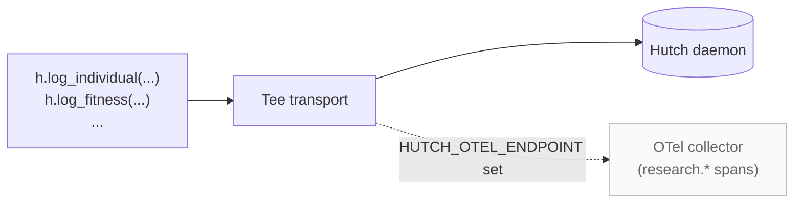

# OpenTelemetry bridge

The OpenTelemetry bridge is **optional** and off by default. The SDK and
daemon do not depend on OpenTelemetry; the bridge ships in a separate
`[otel]` extra.

There are two halves to the bridge, both opt-in:

- **Emit** (shipping in v0.1.0). Every canonical Hutch event additionally
  lands as an OpenTelemetry span on the `research.*` namespace, alongside
  the regular daemon or embedded transport.
- **Subscribe** (planned). Listen to `gen_ai.*` spans your existing
  instrumentation already emits (LangChain, LlamaIndex, OpenAI Agents
  SDK) and translate them into canonical Hutch events.

This page covers the emit path.

## Install

```bash
pip install thehutch[otel]
```

This pulls in `opentelemetry-api`, `opentelemetry-sdk`, and
`opentelemetry-exporter-otlp-proto-http` as optional dependencies. The
SDK still runs without the extra; if `HUTCH_OTEL_ENDPOINT` is set
without it, a one-time warning fires and OTel emission is silently
skipped.

## Enable

Either set an environment variable:

```bash
export HUTCH_OTEL_ENDPOINT=http://localhost:4318
export HUTCH_OTEL_SERVICE_NAME=my-research-loop   # optional
```

…or configure programmatically:

```python
import hutch as h
from hutch.sdk import SDKConfig

h.configure(SDKConfig(
    mode="daemon",                                # or "embedded"
    otel_endpoint="http://localhost:4318",
    otel_service_name="my-research-loop",
))
```

The well-known suffix `/v1/traces` is appended automatically when the
URL doesn't already end with it. Pass the literal `"in-memory"` to wire
up an in-memory exporter for tests.

## How emission fits in



The primary daemon (or embedded) transport keeps running unchanged.
OTel emission is a side-channel; if its endpoint is broken, the primary
path is unaffected.

## Span structure

One canonical event becomes one span. The run is the parent: `run_start`
opens a long-lived span, every per-event child hangs off it, and
`run_end` closes the parent. Out-of-order or envelope-less events still
emit spans; they just don't get parented.

```
hutch.run:run-abc                                     ← open from run_start to run_end
├── hutch.individual    research.individual.id=...
├── hutch.fitness       research.fitness.individual_id=...
│                       research.fitness.score.plausibility=0.85
├── hutch.operator      research.operator.kind=refine
│                       research.operator.cost_usd=0.012
├── hutch.claim         research.claim.id=...
└── hutch.steering_command  research.steering.command=pause_run
```

## The `research.*` attribute namespace

Every span carries `research.event.kind` and `research.run.id`. The
table below lists the per-event-kind attributes; not every attribute
appears on every span.

| event_kind | Attributes |
|---|---|
| `run_start` | `research.run.name`, `research.run.project`, `research.stream.id?`, `research.worker.id?` |
| `run_end` | `research.run.status` |
| `individual` | `research.individual.id`, `.kind`, `.is_seed`, `.parent_ids?`, `.island_id?`, `.generation_index?` |
| `operator` | `research.operator.id`, `.kind`, `.parent_ids?`, `.child_id`, `.cost_usd?`, `.tokens_in?`, `.tokens_out?`, `.llm_id?` |
| `fitness` | `research.fitness.individual_id`, `.evaluator_kind`, `.composite?`, `.invalid_reason?`, `.score.<name>` (one attr per metric), `.scores` (sorted list of metric names) |
| `descriptor` | `research.descriptor.individual_id`, `.archive_id`, `.kind`, `.cell_id?` |
| `self_mod` | `research.self_mod.parent_agent_id`, `.child_agent_id`, `.overseer_verdict?`, `.score_before?`, `.score_after?` |
| `claim` | `research.claim.id`, `.requires_reproduction` |
| `evidence` | `research.evidence.claim_id`, `.stance`, `.confidence?` |
| `steering_command` | `research.steering.command`, `.actor`, `.target_id?` |

The full attribute key list is exported as `hutch.otel.RESEARCH_ATTRS`.

## Stability

From v0.1.0 onward, the `research.*` namespace is additive-only between
Hutch minor versions. New attributes and new value types are fine, but
renaming or removing an existing attribute is a breaking change. We
track the OpenTelemetry GenAI semantic conventions WG; once that
stabilizes, we will align names in a future major version.

## Failure semantics

OTel emission is best-effort. A misconfigured endpoint, a transient
exporter failure, or a serialization issue inside the emitter is logged
at WARNING and swallowed; the primary daemon or embedded transport
continues unchanged. This matches the project-wide rule that SDK calls
do not raise on capture failures by default. Set `HUTCH_STRICT=1` to
opt into raising.

## Why isn't OTel the only emitter?

OpenTelemetry is the right long-term standards play. It is not the
right *only* surface today: the OTel GenAI namespace is still in WG
draft, and adoption velocity in the autoresearch space outpaces
standards velocity. So Hutch's canonical schema stays independent of
OTel, and OTel is an optional emit target on top.
