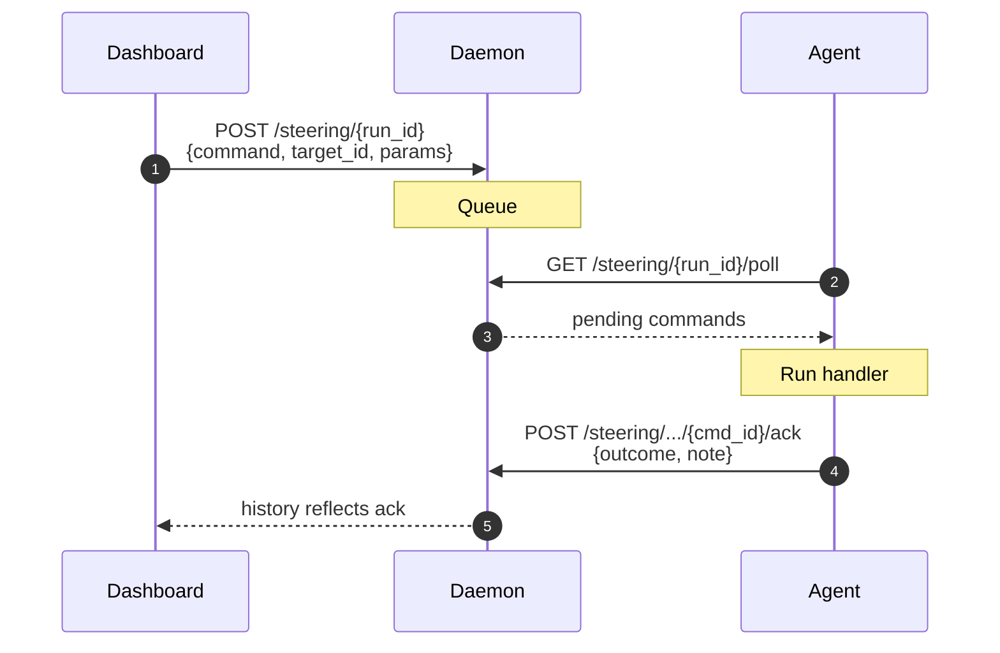

# Steering

Steering is the write-back channel from the dashboard to a running agent.
It is available only for runs that explicitly declare
`capabilities={"steering": True}` and are still running. The agent
registers per-command handlers, calls `hutch.steering.poll()` between
iterations, and acts on the commands it receives. The dashboard has an
issue-command form, an HITL approval banner, and an audit log. Finished
or imported runs show steering history read-only when it exists.



## Command vocabulary

| Command            | When to issue it                                   | Required params      |
|---|---|---|
| `pause_run`        | Pause the agent without killing it                 | (none)               |
| `resume_run`       | Resume after a pause                               | (none)               |
| `cancel_individual`| Skip a specific Individual mid-evaluation          | `target_id` = ind id |
| `freeze_island`    | Stop evolving in one island of an evolutionary run | `target_id` = island id |
| `fork_from`        | Rewind the chain to a previous Individual          | `target_id` = ind id |
| `override_param`   | Change a hyperparameter at runtime                 | `target_id` = param name, `params` = `{value: ...}` |
| `cancel_self_mod`  | Reject a pending self-modification proposal        | `target_id` = self_mod id |
| `approve_hitl`     | Human-in-the-loop checkpoint                       | `target_id` (optional context) |
| `inject_hint`      | Steer the next iteration with free-form text       | `params` = `{text: "..."}` |

The `command` field is the schema's `SteeringCommandKind` literal, so
adding a new value is an additive schema change.

## Agent side

```python
import hutch as h
from hutch import steering

paused = False

@steering.handler("pause_run")
def on_pause(cmd):
    global paused
    paused = True
    return "paused"

@steering.handler("resume_run")
def on_resume(cmd):
    global paused
    paused = False
    return "resumed"

@steering.handler("cancel_individual")
def on_cancel(cmd):
    cancelled.add(cmd.target_id)
    return f"will skip {cmd.target_id}"

h.start_run(name="my-loop", capabilities={"steering": True})
while True:
    steering.poll()        # drains, dispatches, and acks each command
    if paused:
        time.sleep(0.5)
        continue
    do_one_iteration()
```

`poll()` returns the list of commands it processed. A command without a
registered handler is auto-acked with `outcome="rejected"` and a "no
handler" note, so the dashboard accurately reflects what the agent did
or didn't act on. If a handler raises, the command is acked with
`outcome="rejected"` plus the exception text; the loop keeps running.

A handler's return value, if not None, becomes the ack note. Use it as
an audit trail for what the command actually did. Return `None` to ack
without a note.

## Programmatic issuance

```python
from hutch import steering
steering.send(command="pause_run", run_id="run-abc", actor="policy")
```

The same call over HTTP:

```bash
curl -X POST http://127.0.0.1:7777/steering/run-abc \
     -H 'content-type: application/json' \
     -H "authorization: Bearer $HUTCH_TOKEN" \
     -d '{"command":"pause_run","actor":"policy"}'
```

The authorization header is required when the daemon has `HUTCH_TOKEN`
configured. See [security.md](security.md) for browser and dashboard
deployment guidance.

## Daemon endpoints

| Method | Path | What it does |
|---|---|---|
| `POST` | `/steering/{run_id}` | Append a command to the queue |
| `GET`  | `/steering/{run_id}/poll` | Drain pending commands (mark them delivered) |
| `POST` | `/steering/{run_id}/{command_id}/ack` | Agent reports outcome (`accepted`, `rejected`, or `done`) |
| `GET`  | `/steering/{run_id}` | Full history (issue → deliver → ack) for the audit log |

Every state transition is also persisted as a `steering_command` event
in DuckDB, so the audit trail survives a daemon restart. The in-memory
queue is single-process, so a multi-replica deployment will need a
Redis-backed implementation; that is post-v0.1.0 work.

## HITL (human-in-the-loop)

`approve_hitl` is the synchronous gate. Don't auto-handle it: pause your
loop until a human clicks Approve or Reject in the Steering panel. The
UI's Approve action acks with `outcome="accepted"`; Reject acks with
`outcome="rejected"`. Your handler can read the outcome from the
`/steering/{run_id}` history, or simply gate forward progress on seeing
the human's response.

```python
@steering.handler("approve_hitl")
def on_hitl(cmd):
    awaiting_approval[cmd.target_id] = cmd.command_id
    # Don't return; the loop blocks on awaiting_approval below.

while awaiting_approval:
    steering.poll()
    time.sleep(0.5)
```

## Worked example

`examples/07-steering-demo/run.py` is a complete loop demonstrating
`pause`, `resume`, `cancel_individual`, `fork_from`, and `inject_hint`
end to end.
